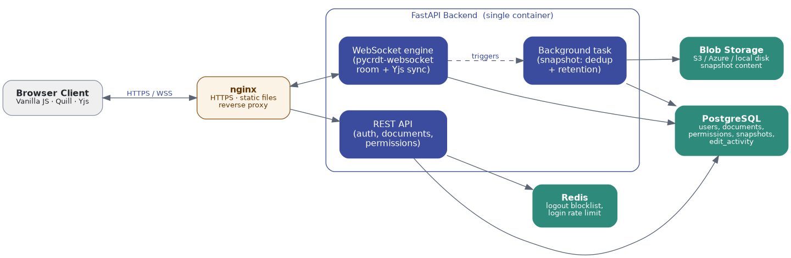
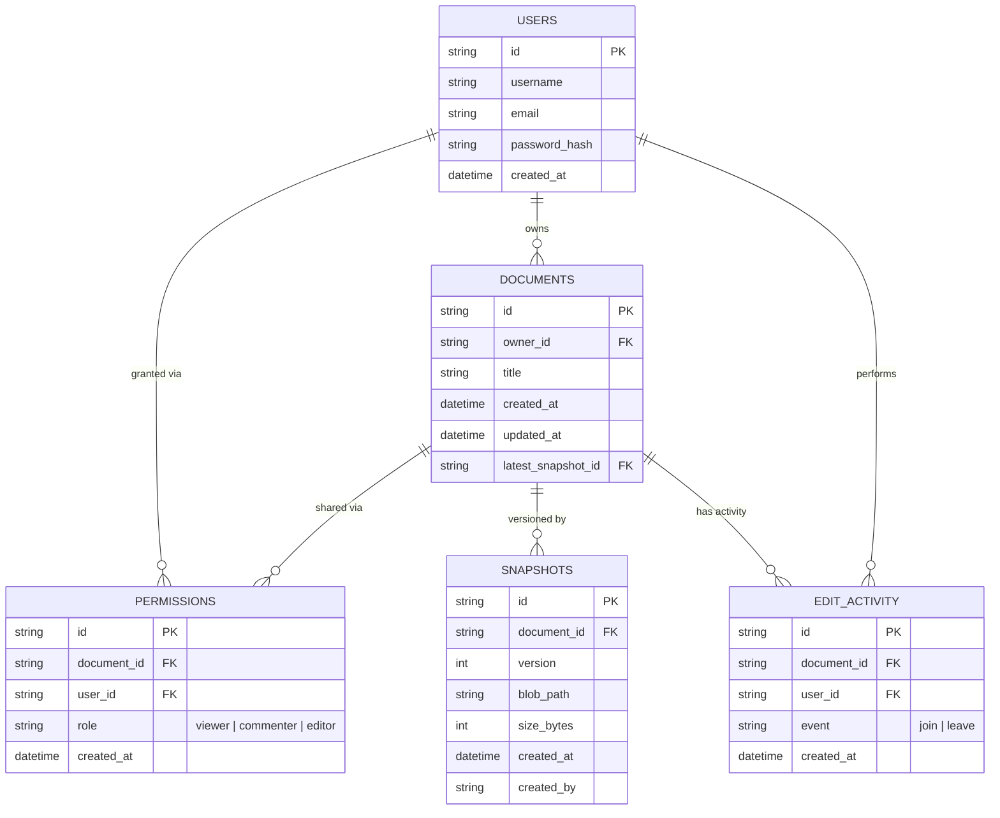

# Docsync

A real-time collaborative text editor

- **Real-time sync**: [Yjs](https://yjs.dev) (CRDT) on the frontend,
  [pycrdt-websocket](https://github.com/y-crdt/pycrdt-websocket) on the
  backend.
- **Backend**: FastAPI, one service, async SQLAlchemy + PostgreSQL, Redis
  (logout blocklist + login rate limiting only), Azure Blob / S3 / local disk
  for snapshot storage (swappable via one setting).
- **Frontend**: Vanilla JS, Quill editor, no build step.
- **Logging**: structured JSON to stdout + Sentry for error tracking and a searchable log
  stream.


## Quick start (Docker, recommended)

```bash
cp .env.example .env
docker compose up --build
```

Backend is now running at `http://localhost:8000` (check `/health`).

Serve the frontend separately (it's static files, no build step):

```bash
cd frontend
python3 -m http.server 5500
```

Open `http://localhost:5500`. Register an account, create a document, open
it in a second browser (or an incognito window) as a different user to see
real-time sync and presence.

## Quick start (without Docker)

```bash
cd backend
python3 -m venv venv && source venv/bin/activate
pip install -r requirements.txt
cp ../.env.example ../.env      # DATABASE_URL defaults to a local SQLite file
uvicorn app.main:app --reload
```

Redis is still required (Docker is the easy way to get one: `docker run -p
6379:6379 redis:7-alpine`), since the login/logout flow depends on it. Run
`python3 -m http.server 5500` in `frontend/` as above.

## Architecture




**Why there is no per-keystroke `Operations` table:** Yjs already stores each
insert and delete in its binary CRDT updates. Saving every small change in a
database table would only duplicate information that Yjs is already tracking.
Instead, the backend periodically saves the *current state* of an actively
edited document (`room.ydoc.get_update()`) as one blob, along with a `Snapshots`
row that points to it. This happens on a timer (`SNAPSHOT_INTERVAL_SECONDS`,
three minutes by default) and again when the last person leaves the document.
That way, even if nobody clicks save, you should never lose more than a few
minutes of work.

**Why Redis has a smaller role:** the original design used Redis as the
document's "canonical copy" and to broadcast cursor and presence updates. In
practice, `pycrdt-websocket`'s Awareness protocol handles presence in memory
and sends updates directly between connected clients. At the scale of a
single instance, Redis does not need to be involved in that process. It is
still useful for two things: blocking logged-out JWTs until they expire and
limiting repeated login attempts to help prevent brute-force attacks.

## Database schema




`PERMISSIONS` links `USERS` and `DOCUMENTS` in a normalized many-to-many
relationship, with the user's role stored on the link.`EDIT_ACTIVITY` is a separate,
user-facing audit trail shown in the editor's Activity panel.
It records who joined or left a document and when; it is not
the same as the operational logs described below, which are intentionally kept
out of Postgres.

Full column definitions: `backend/app/models.py`. Migrations:
`backend/alembic/versions/`.

The `Snapshots` table is used only for automatic saves. Document version
rollback is not currently supported, so there is no version-history API or UI;
when a user reconnects, the editor simply loads the most recent snapshot.

## Logging

Two different things, kept separate on purpose:

- **Audit trail** (`EDIT_ACTIVITY` table above) -- who was in a document and
  when. A real, queryable feature.
- **Operational logs** -- requests, WebSocket connects, exceptions. These do
  *not* go in Postgres. `backend/app/logging_config.py` writes structured
  JSON to stdout (`docker compose logs -f backend`), and if you set
  `SENTRY_DSN` in `.env`, `sentry-sdk` also captures every unhandled
  exception with a full stack trace plus forwards ERROR-level log calls,
  viewable on Sentry's dashboard. Sentry is bundled free with your GitHub
  Student Developer Pack -- activate it at
  [sentry.io/for/education](https://sentry.io/for/education), create a
  project, copy the DSN into `.env`.

## Switching Azure -> AWS

Everything cloud-specific is isolated behind `STORAGE_PROVIDER` in `.env`:

```
STORAGE_PROVIDER=local   # default -- zero setup, snapshots on local disk
STORAGE_PROVIDER=azure   # needs AZURE_STORAGE_CONNECTION_STRING
STORAGE_PROVIDER=aws     # needs AWS_ACCESS_KEY_ID / AWS_SECRET_ACCESS_KEY / S3_BUCKET
```

You don't need to change any other application code. The storage providers are
kept in `backend/app/storage/`: `base.py` defines the interface, while
`azure_blob.py`, `s3.py`, and `local.py` provide interchangeable implementations.
The VM you deploy to is cloud-agnostic too; deployment uses the same SSH and
Docker setup either way. See `.github/workflows/ci-cd.yml` for the details.

## Deploying (Azure, via your GitHub Student Pack)

1. Activate **Azure for Students** at
   [azure.microsoft.com/free/students](https://azure.microsoft.com/free/students)
   (no card needed, tied to your GitHub Student Pack verification).
2. Create a small Linux VM (B1s size is enough), install Docker on it.
3. Create an Azure Storage account + container for snapshots, copy the
   connection string into your VM's `.env` (`STORAGE_PROVIDER=azure`).
4. `git clone` this repo onto the VM, `cp .env.example .env` and fill it in,
   `docker compose up -d`.
5. Set up the GitHub Actions secrets below so pushes auto-deploy here.

## CI/CD

`.github/workflows/ci-cd.yml`: push (or PR) to `dev` runs the test suite; a
push specifically (not a PR) also builds the Docker image, pushes it to
Docker Hub, SSHes into your VM to deploy, and opens a PR from `dev` into
`main` for review and merge. Any failure emails i will get mail.

Repo secrets to add (Settings -> Secrets and variables -> Actions):

| Secret | What |
|---|---|
| `DOCKERHUB_USERNAME`, `DOCKERHUB_TOKEN` | Free Docker Hub account + access token |
| `DEPLOY_HOST`, `DEPLOY_USER`, `DEPLOY_SSH_KEY` | Your VM's IP, SSH user, and private key |
| `MAIL_USERNAME`, `MAIL_PASSWORD`, `NOTIFY_EMAIL` | For the failure-notification email (a Gmail app password works) |


## Running the tests

```bash
cd backend
pip install -r requirements-dev.txt
pytest tests/ -v
```

Needs a Redis instance reachable at `redis://localhost:6379/0` (the login
rate-limiter and logout blocklist depend on it); everything else runs against
an isolated temp-file SQLite database per test session, so tests never touch real data.
